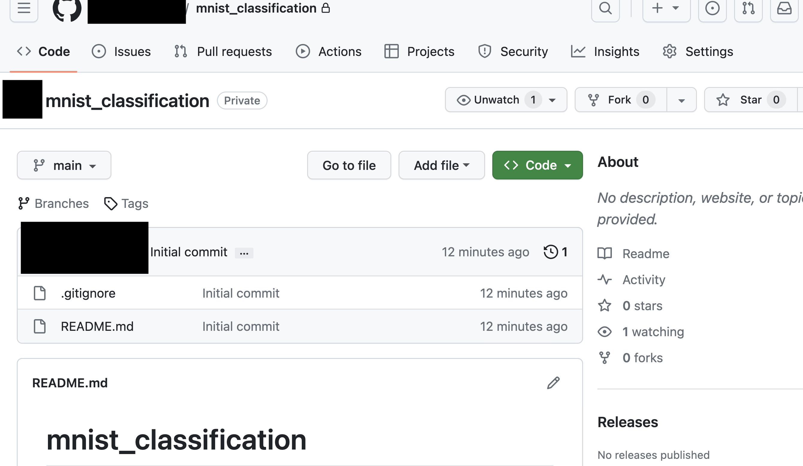

- Step 1: Set Up the Project
  - Create bare remote repository
  - 
Step 2: Install dependencies
Step 3: Create Neural Network Files - dataset, trainer, validator, main
Step 4: Push Changes to Remote Repository
