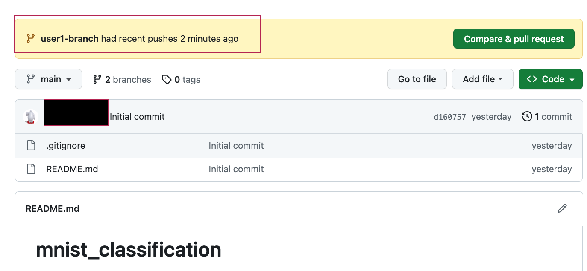

# Set up remote and local repository
  **Step 1: Set Up the Project**
    __User1 : Create bare remote repository__
    - 
  **Step 2: Open terminal and cd to location to clone the remote github repository**
  **Step 3: Clone to local machine**
    __User1 and User2: Clone repo to local machine__
    ```git clone https://github.com/<username>/mnist_classification.git```
    - 
    - [Hear the clone command](https://github.com/prathebaselva/cs897/assets/38529810/4f1d2e77-79ba-4c0f-aa2f-721239c76151)
  
  **Step 4: Create branches**
    __User 1 : create branch1 from remote repo__
      ```git checkout -b user1-branch```
    __User 2 : create branch2 from remote repo__
      ```git checkout -b user1-branch```
    - 
    - [Hear the branch command](https://github.com/prathebaselva/cs897/assets/38529810/de1b16f9-e778-461e-ac9c-83ebba3d2bcc)

# Steps to create the project files
  **Step 5: Create to Commit**
   __Step 5.1: User1 - Create a Neural Network model file__
     - ``` vi model.py```
   __Step 5.2: User1 - Add model file to repository__
     - ``` git add model.py ```
   __Step 5.3: User1 - Check status (optional)__
     - ``` git status ```
     - This should show that the model.py file as been added and the changes are yet to be committed
   __Step 5.4: User1 - Commit the file__
     - ``` git commit -m "model file added" ```
   __Step 5.5: User1 - Check status (optional)__
     - ``` git status ```
       This should show that there is no other files to commit and the working branch is clean
   __Step 5.6: User1 - Check log__
     - ``` git log ```
     - This should show the log for 'add' and 'commit' with unique log id
   - 
   **__Note that user2-branch has no file and is clean__**
- Step 6: User1 - Push from local branch to remote repository
  ``` git push origin user1-branch ```
  - 
- Step 7: Verify push
  - Open remote repository and you will see something like this
  - 
  - A message pop-up showing that a particular branch has been added and the drop down option will now show two working branches
    - main
    - user1-branch
  - 
  - Since the local branch 'user2-branch' has not added any file and pushed it to remote repository, that branch information is still not visible
  
- Step 8: User 2 - Git pull from user1_branch
  - ``` git pull origin user1-branch ```
  - 

** Reverting commits **
- Step 9: User1 - Realizes the model.py file needs one more import and decides to revert the commit made to remote repository
  - The git revert command is a safer option for undoing changes on shared branches because it creates a new commit that undoes the changes without altering the commit history. If you want to completely remove the commit and its history (which is generally not recommended for shared branches), you might consider using git reset and force-pushing. However, be cautious with force-pushing as it rewrites the commit history and can cause issues for collaborators.
  - Step 9.1: check git log
    - ``` git log ```
    - 
    - There are two commit-hash, one for git add and one belong to commit.
  - Step 9.2: Copy the commit-hash,
    - here ```5d32c2efd2981b8a35a57d965160960fe246f21b```
  - Step 9.3: Start git revert of the commit
    - ``` git revert 5d32c2efd2981b8a35a57d965160960fe246f21b ```
    - ``` git revert d1607577a29a6e8390d0e70ab2eebde3a7346593 ```
    - This will open up a ext editor (in our case vi editor)
    - 
    - Add any additional command you want to and save the file (w!)
  - Step 9.4: Git add the changes
    - ``` git add . ```
  - Step 9.5: Git commit the changes
    - ``` git commit -m "reverting commit by 5d32c2efd2981b8a35a57d965160960fe246f21b and d1607577a29a6e8390d0e70ab2eebde3a7346593" ```
  - Step 9.6: Git push the changes to remote
    - ``` git push origin user1-branch ```
    - If you open the remote repository, you will find that no files exists
    - 
  
